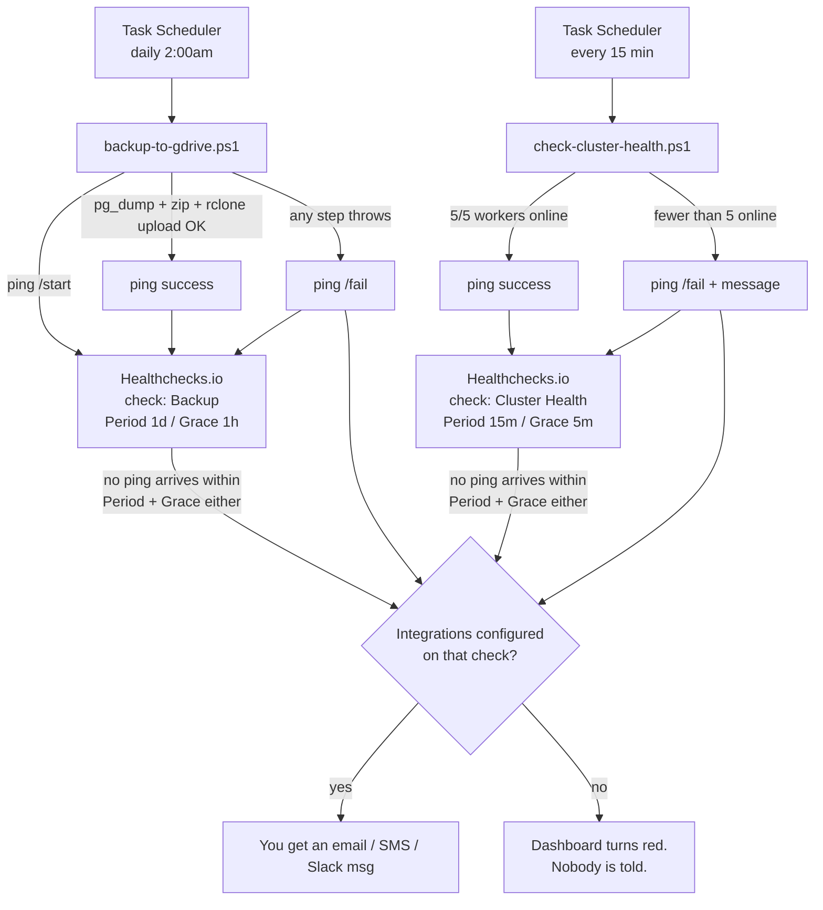

# Alerting Flow — Backup (2am) & Cluster Health (15min)

What actually happens, end to end, when the two scheduled jobs run — and whether you get notified when one fails. Read `BACKUP_DR.md` and `MONITORING.md` first for setup; this page is just the "then what?" flow.

## ⚠️ Current status on this machine

Checked while writing this doc:

- `.env` has **no** `HEALTHCHECK_BACKUP_URL` or `HEALTHCHECK_CLUSTER_URL` set
- **Neither** `QuburBackupToGDrive` nor `QuburClusterHealthCheck` scheduled task is registered in Task Scheduler yet

So right now, nothing is actually scheduled and nothing would notify you. Everything below describes how it behaves *once* both are set up per `BACKUP_DR.md` §5 and `MONITORING.md` §2 — treat this as the target flow, not the current state.

## The key thing to understand

**The PowerShell scripts never send you a notification directly.** They only send an HTTP ping (`/start`, plain, or `/fail`) to a Healthchecks.io URL. Healthchecks.io is the thing that decides to alert you — and only through whatever channels (email/SMS/Slack/etc.) you've turned on in **that check's own Integrations tab**. Two separate checks (backup, cluster) means two separate places that need integrations configured.

No integrations configured on a check → the ping still arrives, the check still shows red on the Healthchecks.io dashboard → but nobody gets pinged. This is the #1 way "I set up monitoring" quietly turns into "monitoring exists but tells nobody."

## Flow diagram

## Failure scenarios, spelled out

| What happens | Does the script know? | Does Healthchecks.io know? | Do you get notified? |
|---|---|---|---|
| `pg_dump` fails, rclone upload fails, or any step throws | Yes — catches it, pings `/fail` immediately | Yes — gets the `/fail` ping right away | **Yes**, if integrations are set on the Backup check |
| A PM2 worker crashes (e.g. 4/5 online) | Yes — counts online workers, pings `/fail` with `"Only 4/5 ... workers online"` as the body | Yes — immediately | **Yes**, if integrations are set on the Cluster check |
| The whole server is off / Docker is down at 2am, so the task never runs at all | N/A — script never executed | **Yes, eventually** — no ping arrives, Healthchecks.io flags it "Down" once Period (1 day) + Grace (1 hour) elapses, i.e. by ~3am the day after it should've run | **Yes** — this is the dead-man's-switch case, and it's the whole reason to use Healthchecks.io instead of only try/catch in the script |
| Task Scheduler task itself is disabled, deleted, or misconfigured (wrong account, expired credential) | N/A | Same as above — silence past Period+Grace trips the alert | **Yes**, same delay as above |
| Script runs and succeeds normally | Pings plain success URL | Check shows green, timer resets | No notification (correct — nothing to say) |
| Script fails, **but you never configured integrations** on that check | Yes, pings `/fail` correctly | Yes, shows red on the dashboard | **No.** The failure is fully visible on Healthchecks.io's site, but nothing pushes it to you — you'd only see it if you happened to open the dashboard |
| `rclone.conf` auth token expires (e.g. app left in Google "Testing" mode, see `BACKUP_DR.md` §2) | Yes — `rclone` exits non-zero, script throws, pings `/fail` | Yes | **Yes**, if integrations configured — comes through as a normal backup failure, not anything special |
| The account backup app is unreachable (Healthchecks.io itself down, or outbound HTTP blocked from the server) | The script tries the ping, catches the exception (`Write-Warning "Healthchecks ping failed..."`), and **continues/exits normally either way** — a failed ping never crashes the script | Depends — if the ping truly never arrived, Period+Grace dead-man's-switch still eventually fires once connectivity is back... but if Healthchecks.io itself is down, no one is watching | Not guaranteed — this is the one gap neither script nor Healthchecks.io can fully cover. Very rare in practice |

## Timing, concretely

- **Backup check** (Period = 1 day, Grace = 1 hour): if the 2am run doesn't succeed *or* doesn't happen at all, you'd hear about it by roughly **3am the next day** at the latest.
- **Cluster health check** (Period = 15 min, Grace = 5 min): if a run fails or stops happening, you'd hear about it within **~20 minutes**.
- **App uptime** (external monitor like UptimeRobot, `/health` endpoint, 5-minute interval) is a *third*, separate, active check — that service pings *you*, not the other way round, so it has no Period/Grace concept and just alerts within one polling interval (~5 min) of `/health` returning non-200. See `MONITORING.md` §1.

## Where to check by hand (no notification needed)

- Healthchecks.io dashboard — both checks' current color + last-ping history, regardless of whether integrations are wired up
- Task Scheduler → Task Scheduler Library → `QuburBackupToGDrive` / `QuburClusterHealthCheck` → History tab — shows if/when the task actually fired and its exit code
- `rclone lsd gdrive:qubur-backups` — confirms a new dated folder actually landed, independent of what any check reports
- `.\scripts\check-cluster-health.ps1` run manually — prints `N/5 'qubur-backend' workers online` directly to the console

## Checklist to make "full" alerting real

1. Add `HEALTHCHECK_BACKUP_URL` and `HEALTHCHECK_CLUSTER_URL` to `.env` (two separate Healthchecks.io checks — see `BACKUP_DR.md` §5 and `MONITORING.md` §2 for the exact Period/Grace values)
2. On **each** check's Healthchecks.io page, open **Integrations** and turn on at least one of email/SMS/Slack/etc. — this step is what the scripts themselves can't do for you
3. Register both scheduled tasks (`BACKUP_DR.md` §5, `MONITORING.md` §2), with `-User`/`-Password` so they run unattended
4. Do one manual **Run** of each task from Task Scheduler's UI right after creating it, and confirm the corresponding Healthchecks.io check goes green
5. Optionally, force a failure once (stop a PM2 worker, or temporarily point `-HealthcheckUrl` at a bad check) to confirm a notification actually lands in your inbox/phone/Slack — testing the happy path only proves half the setup
