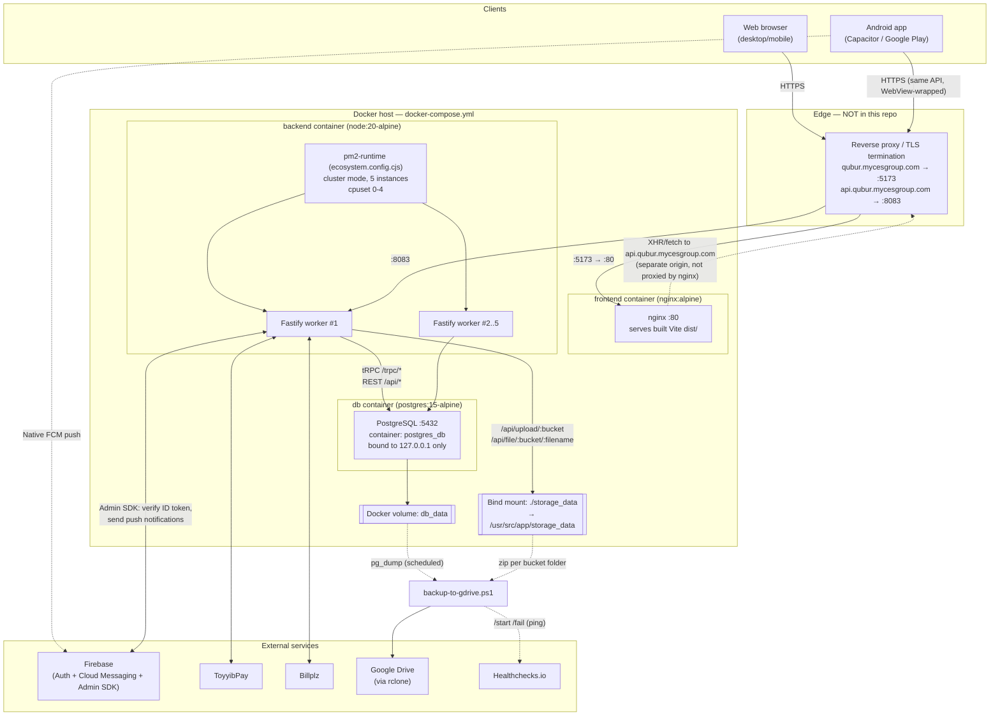
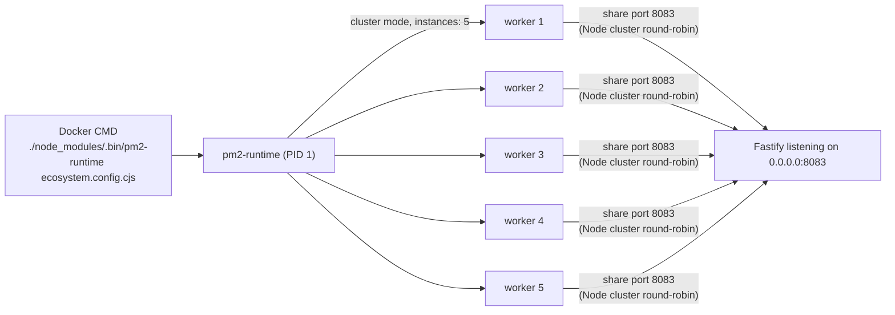
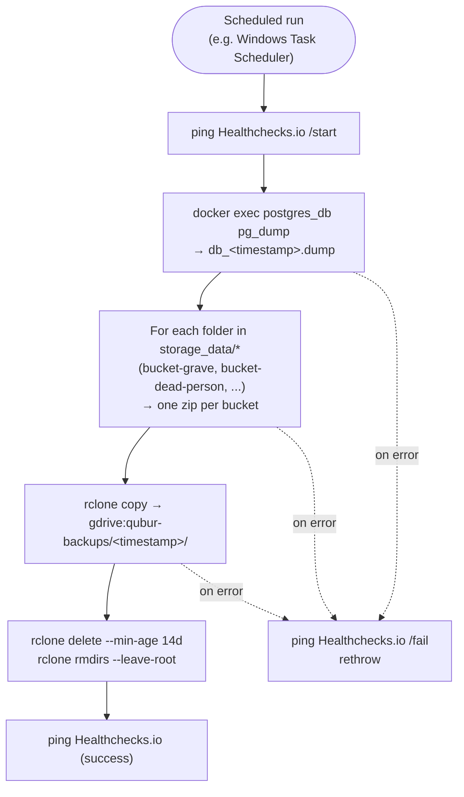

# QubuR — Full System Architecture

End-to-end view: user devices → reverse proxy → Docker Compose stack → database/storage → backup pipeline. Ports and container names below are taken directly from `docker-compose.yml` / `docker-compose.dev.yml` / `backend/ecosystem.config.cjs` — not guessed.

> **Not in this repo:** the reverse proxy / TLS termination that maps `qubur.mycesgroup.com` and `api.qubur.mycesgroup.com` to the host ports below. Docker Compose only publishes plain HTTP on `5173` and `8083`; something in front of the host (Nginx, Caddy, Cloudflare Tunnel, etc.) must be doing HTTPS + domain routing. Fill this box in with whatever's actually configured on the VPS.

## 1. Production request flow (docker-compose.yml)

## 2. Component table

| Component | Tech | Container / process | Port(s) | Notes |
|---|---|---|---|---|
| Web frontend | React + Vite, built to static `dist/` | `frontend` (nginx:alpine) | host `5173` → container `80` | Pure static file server; no server-side rendering |
| Mobile app | Same React app wrapped by Capacitor | Android (`capacitor/android`) | — | Ships via Google Play; no separate backend, hits the same `api.*` domain |
| Backend API | Fastify + tRPC (TypeScript) | `backend` (node:20-alpine) | host `8083` → container `8083` | Process-managed by PM2 (see §3) |
| Database | PostgreSQL 15 | `db` a.k.a. `postgres_db` | `127.0.0.1:5432` → `5432` | Bound to localhost only in prod — not reachable from outside the host |
| File storage | Local disk (`STORAGE_DRIVER=disk`, default) or S3 (`STORAGE_DRIVER=s3`) | bind mount `./storage_data` | — | One subfolder per bucket (`bucket-grave`, `bucket-dead-person`, …); served via `GET /api/file/:bucket/:filename`, written via `POST /api/upload/:bucket` |
| Auth | Firebase Auth (Google SSO) + custom JWT | inside `backend` | — | `verifyToken()` reads Bearer header or `accessToken` httpOnly cookie on every request (`onRequest` hook) |
| Push notifications | Firebase Cloud Messaging | `backend` (sender) + browser SW / Capacitor plugin (receiver) | — | Web: `public/firebase-messaging-sw.js`. Android: `@capacitor/push-notifications` |
| Payments | ToyyibPay, Billplz | inside `backend` | — | Config validated at boot (`server.ts` logs missing keys) |
| Backup | PowerShell script + rclone | runs on the Docker **host** (not containerized) | — | `scripts/backup-to-gdrive.ps1`, see §4 |

## 3. Process management inside the backend container

- `backend/ecosystem.config.cjs` → `exec_mode: "cluster"`, `instances: 5`.
- `docker-compose.yml` pins the container to `cpuset: "0-4"` (5 cores) to match.
- `pm2-runtime` (not `pm2`) is used deliberately — it runs in the foreground and is built to be container PID 1, forwarding `SIGTERM`/`SIGINT` to its workers for a clean `docker stop`.

## 4. Backup pipeline (`scripts/backup-to-gdrive.ps1`)

- Runs **outside** Docker, directly on the host, using `docker exec` to reach the `postgres_db` container.
- Storage backup is one zip per bucket subfolder (not a single monolithic archive), uploaded alongside the DB dump into a single timestamped remote folder.
- `HEALTHCHECK_BACKUP_URL` (from `.env`) gets pinged at start/success/fail so a missed or failed backup run surfaces as an alert.

## 5. Dev environment (`docker-compose.dev.yml`)

Same three services, different wiring for live-reload:

| Component | Prod | Dev |
|---|---|---|
| Frontend | Multi-stage build → static nginx on `80`, published as `5173` | Vite dev server, bind-mounted source, published as `5174` |
| Backend | Built once (`npm run build`) + `pm2-runtime`, cluster ×5 | Bind-mounted source + `CHOKIDAR_USEPOLLING` for hot reload, published as `${BACKEND_PORT:-8083}` |
| Postgres | Port bound to `127.0.0.1` only | Port open on `${POSTGRES_PORT:-5432}` (all interfaces) |
| Env file | `.env` | `.env.dev` |

## 6. Key request paths

- **Normal API call:** Browser/App → (reverse proxy) → Fastify (`/trpc/*`) → TypeORM → Postgres.
- **File upload:** Browser/App → `/api/upload/:bucket` → disk (or S3) storage + `StoredFile` metadata row in Postgres.
- **File view/download:** Browser/App → `/api/file/:bucket/:filename` → storage read → `Content-Type` + `Content-Disposition: inline` → rendered client-side (canvas for PDFs via `react-pdf`, `` for images) with an explicit download button.
- **Push notification:** Backend event (e.g. jenazah case created) → `firebase.service.ts` → Firebase Cloud Messaging → web Service Worker *or* Android FCM → tap opens a specific in-app page (`notificationUrls.ts` maps event → URL).
- **Auth:** Firebase ID token (Google SSO) verified server-side via Firebase Admin SDK, or a custom JWT (Bearer header / httpOnly cookie) verified via `verifyToken()` on every request.
